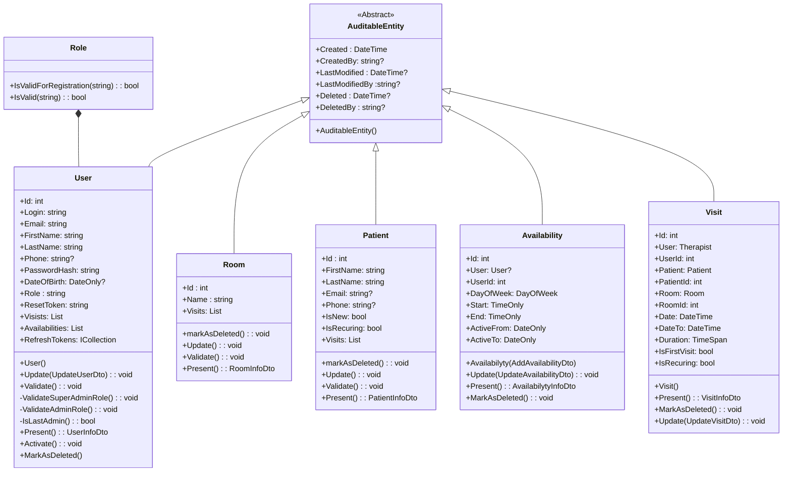
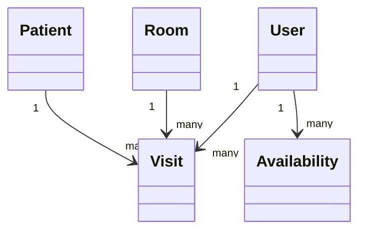

# Medical Appointment Booking System

## Project Overview

The Medical Appointment Booking System is an application designed to manage patient appointments.
It provides functionality for user registration, login, adding patients, managing doctor availability, and scheduling appointments.
The system features an intuitive calendar view, making appointment management easier for medical facilities.

## Main Features

- **User registration and login**
- **Patient management**
- **Doctor availability management**
- **Medical appointment booking**
- **Calendar view for appointment management**
- **Automated testing** (unit, integration, end-to-end)

## Technologies and Tools

- **Backend:** .NET 6+
- **Database:** SQL Server / Azure SQL
- **CI/CD:** Azure DevOps
- **Testing:** 
  - Unit and integration tests (NUnit, Xunit)
  - End-to-end tests using Playwright
  - TestContainers
- **Static Code Analysis:** SonarCloud (improves code security, readability, and maintainability)
- **Hosting:** Azure App Services

## System Requirements

- .NET SDK 6.0 or higher
- SQL Server or Azure SQL
- Azure DevOps account (optional for full CI/CD automation)

## Class diagram

## Database structure

